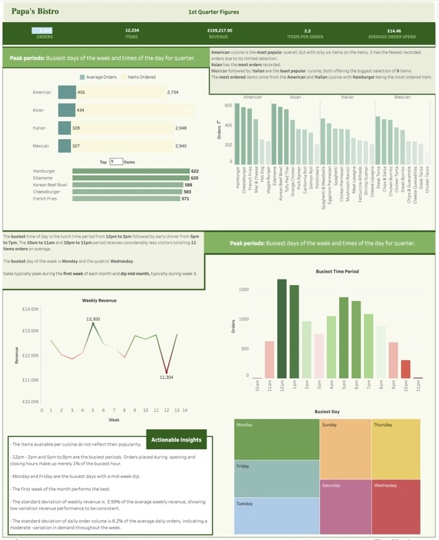

 # Papa's Bistro Restaurant
Analysis of Papa's Bistro's 1st Quarter figures

# **Introduction**

This project presents a first-quarter order analysis for Papa's Bistro, a fictional restaurant developed for evaluation purposes. The dataset includes detailed order and menu information, forming the basis for analyzing overall performance. 

# **Variables included in the data set**  
**Table 1: Order Details** 

* **order_details:** A unique identifier assigned to each item ordered.  
* **order_id:** ID that identifies each order.  
* **date:** Order date  (MM/DD/YY).  
* **time:** Time order was taken (HH:MM:SS AM/PM).
* **item_id:** ID that identifies each item in Menu Items table.

**Table 2: Menu Items** 
* **item_id:** ID that identifies each menu item
* **Cuisine:** Cuisine the menu item belongs to.
* **Item_name:** Name of menu item.
* **Price:** Price of menu item.

# **Project Overview**  
This project examines dish performance, customer behavior, peak business periods and revenue. The insights gained from this analysis aim to support strategic decision-making and help forecast future trends.

# **Objectives:**  
*Extract and import data into Postgresql database.  
*Clean data to ensure accuracy.  
*Explore and analyse the data to evaluate performance.  
*Use the data analysis findings to create explanatory visuals to provide greater insight.  
*Create actionable insights that can be used to improve the customer experience and increase profitability.

# **Data sources**  
Restaurant Orders:
https://mavenanalytics.io/data-playground?order=date_added%2Cdesc&search=restaurant)](https://mavenanalytics.io/data-playground?order=date_added%2Cdesc&search=restaurant

# **Tools Used:**  
Postgresql
Tableau

# **QUESTIONS**

1) What are most popular items on the menu?
2) What is the most popular cuisine on the menu?
3) How many items are ordered on average per transaction?
4) What is the average transaction amount?  
5) How are sales performing over time? 
6) What is the busiest day of the week (what days are most orders put through)?   
7) What day of the week performs best revenue wise?
8) On average which period of the day is busiest? List from busiest to least busiest period showing sales revenue and orders

___

# **Insights**

1) The most popular item on the menu is Hamburger with Edamame a close second.

2) American cuisine is the most frequently ordered, as measured by the average number of items sold. Notably, there is an inverse relationship between the number of items available within a cuisine and its overall popularity. Despite offering only 6 items, American cuisine outperforms Mexican and Italian cuisines, both of which offer 9 items yet rank lowest in average orders.

3) An average of 2.3 items are ordered per transaction, indicating that customers typically select multiple items per visit.

4) The average transaction amount is £14.46. Being that the mean prices of menu items is £13.33 suggests that customers are more frequently purchasing lower-priced items.

5) Variation in weekly sales revenue is small which will make for more accurate forecastng. Sales revenue typically peaks every first week of the month.

6) Mondays and Fridays are the busiest days of the week in terms of items ordered. There is a mid-week dip on Wednesdays which is the quietest day of the week. Overall the variation in demand throughout the week is moderate.

7) The days generating the highest sales revenue aligns with the busiest days of the week. The strong positive correlation between the number of items ordered and overall revenue indicates that increased footfall or order frequency directly drives higher income, rather than high-value item purchases or transactions.

8) 12pm - 2pm is the busiest period followed by 5pm - 8pm. The opening and closing hour are extremely quiet. Adjusting operating hours may help optimize resource allocation and improve overall profitability.

# **Data Visualisation**
Interact with the dashboard here: https://public.tableau.com/app/profile/kemi.hinkson.adewunmi/viz/DiningPerformance/Dashboard1

  
